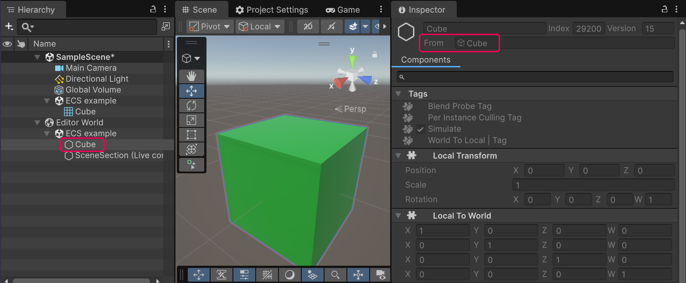
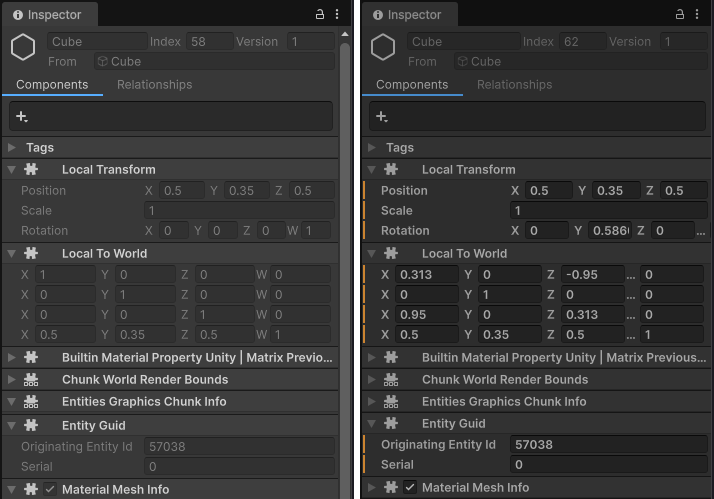

# Entity Inspector reference

When you select an entity in the [Hierarchy window](https://docs.unity3d.com/6000.5/Documentation/Manual/new-hierarchy.html), the [Inspector](https://docs.unity3d.com/Manual/UsingTheInspector.html) displays information about that entity.

 _Entity Inspector view with an Entity selected in Hierarchy_

To view the authoring data for a GameObject that an entity was converted from, select the GameObject in the **From** field of the Inspector.

## Components tab

The **Components** tab displays all the [components](concepts-components.md) on the selected entity, similar to how the Inspector displays MonoBehaviour components on a GameObject.

The fields in the **Components** tab have two states:

* In Edit mode, they're read-only.
* In Play mode, you can edit them for debugging purposes. When you exit Play mode, the [baking](baking-overview.md) process overrides any changes you made.

The orange or red vertical bars next to fields indicate data that does not persist between the modes (the color of the bar depends on the Editor theme).

 _Entity Inspector in Edit mode (left), and Play mode (right). The orange vertical bars in Play mode indicate that Unity destroys the data when you exit Play mode._

## Additional resources

* [Entities user manual](concepts-entities.md)
* [Hierarchy window reference](editor-hierarchy-window.md)
* [System Inspector reference](editor-system-inspector.md)
