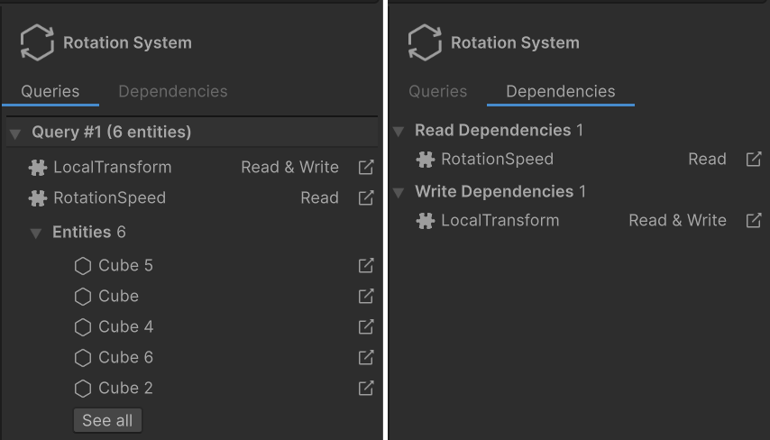

# System Inspector reference

When you select a system in the [Systems window](editor-systems-window.md), the details panel on the right side of the window displays information about the system in two tabs:

* **Queries**: Displays the [queries](systems-entityquery.md) that the selected system runs, the components that each query searches for, and the entities that match each query.
* **Dependencies**: Displays the components that the system depends on for reading and writing.

 _System Inspector: Queries (left), Dependencies (right)_

To show or hide the details panel, click the details icon (**i**) in the Systems window toolbar.

## Queries tab

The Queries tab displays each query that the selected system runs, in the order that the queries are declared in the system. The header of each query displays the number of entities that currently match the query.

Each query displays the following information:

* The components that the query searches for. The label next to each component displays either the system's access rights to the component (**Read**, **Read & Write**, or **Exclude**), or how the query filters entities by the state of that component (**Disabled**, **Present**, or **Absent**). For more information about enabled states, refer to [Enableable components](components-enableable.md).
* An **Entities** subsection, which lists up to five of the entities that match the query. Select the icon to the right of an entity to select it in the hierarchy.

If more than five entities match a query, a **See all** button appears in the **Entities** section. Selecting that button creates a query in the Hierarchy search field to display all the matching entities.

## Dependencies tab

The Dependencies tab displays the component types that the selected system declares as job dependencies. It has two sections:

* **Read Dependencies**: Lists the components that the system registers a read dependency on. These are components the system's jobs read from.
* **Write Dependencies**: Lists the components that the system registers a read-write dependency on. These are components the system's jobs write to.

## Additional resources

* [System user manual](concepts-systems.md)
* [Systems window reference](editor-systems-window.md)
* [Entity Inspector reference](editor-entity-inspector.md)
