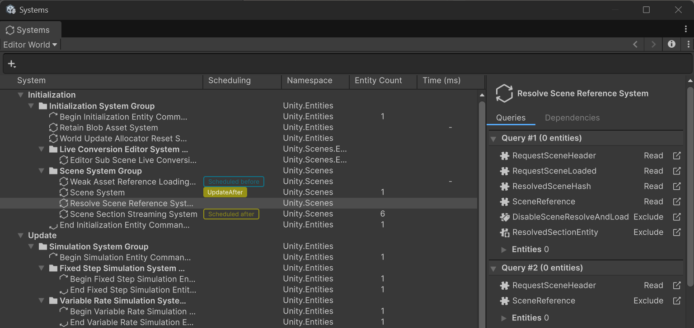

# Systems window reference

The Systems window displays information about the system update order of each [world](concepts-worlds.md) in your project. The window displays a hierarchy of systems, shown inside their [system groups](concepts-systems.md#system-groups), and updates when the systems in your application run and update. 

To open the Systems window, go to **Window &gt; Entities &gt; Systems**. 

 _Systems window with a system selected_

The Systems window displays a tree view of systems in the selected world. When you select a system, the [System Inspector](editor-system-inspector.md) on the right side of the window displays more information about the selected system.

## Toolbar

The toolbar at the top of the window contains the following elements:

|**Control**|**Description**|
|---|---|
|World selector|Selects the world whose systems the window displays. When you enable **Show All Worlds** in the More menu (⋮), an **All Worlds** label replaces the world selector.|
|Search field|Filters the systems displayed in the tree view. For more information, refer to [Systems search field](#systems-search-field).|
|Back and forward buttons|Move backwards and forwards through the systems that you previously selected. When you select a different world, the window clears the selection history.|
|Details panel icon (**i**)|Shows or hides the details panel on the right side of the window, which contains the [System Inspector](editor-system-inspector.md).|
|More menu (⋮)|Contains additional view options. For more information, refer to [More menu](#more-menu).|

### More menu

The More menu (⋮) has the following options:

|**Option**|**Description**|
|---|---|
|**Show Player Loop**|Displays the methods that are part of the Unity [player loop](https://docs.unity3d.com/ScriptReference/LowLevel.PlayerLoop.html), including methods that are not specific to Entities. The window displays methods that are not Entities-specific as grayed out.|
|**Show All Worlds**|Displays the systems of all the worlds in your project, instead of the systems of the world that's selected in the world selector.|
|**Show Unity-Namespaced Systems**|Displays the systems that belong to the `Unity`, `UnityEngine`, and `UnityEditor` namespaces, such as the systems that the Entities package and other Unity packages define. This option is enabled by default. Disable it to display only the systems that belong to other namespaces, such as the systems that you defined in your project.|
|**Entities Preferences**|Opens the [Entities section of the Preferences window](editor-preferences.md).|

## System tree view

The tree view has the following columns.

|**Column**|**Description**|
|---|---|
|Systems|A list of the systems in your application. When you select a system, its details appear in the [System Inspector](editor-system-inspector.md) on the right side of the window. There are several icons that represent the system types:<ul><li> A system group</li><li> A system</li><li> An [entity command buffer](systems-entity-command-buffers.md) system that runs at the beginning of a system group using the [OrderFirst](xref:Unity.Entities.UpdateInGroupAttribute.OrderFirst) argument.</li><li> An [entity command buffer system](systems-entity-command-buffers.md) that runs at the end of a system group using the [OrderLast](xref:Unity.Entities.UpdateInGroupAttribute.OrderLast) argument.</li></ul>|
|Scheduling|Displays how each system relates to the update order of the selected system. For more information, refer to [Scheduling column](#scheduling-column).|
|Namespace|The namespace that the system type belongs to.|
|Entity Count|The number of entities that match the system's [queries](systems-entityquery.md) at the end of the frame.|
|Time (ms)|The amount of time in milliseconds that the system took during this frame. |

To help debug your application, you might want to temporarily disable a system. To do this, click the left-most column, which is darker than the other columns, next to the system you want to disable. This change doesn't persist across Editor sessions. 

### Scheduling column

The Scheduling column displays the update order relationships between the selected system and the other systems, based on their [`UpdateBefore`](xref:Unity.Entities.UpdateBeforeAttribute) and [`UpdateAfter`](xref:Unity.Entities.UpdateAfterAttribute) attributes. When you select a system, a label appears in the Scheduling column of each system that has a direct update order relationship with the selected system:

* **UpdateBefore**: The selected system has an `UpdateBefore` attribute that targets this system. The selected system updates before this system.
* **UpdateAfter**: The selected system has an `UpdateAfter` attribute that targets this system. The selected system updates after this system.
* **Scheduled before**: This system has an `UpdateBefore` attribute that targets the selected system. This system updates before the selected system.
* **Scheduled after**: This system has an `UpdateAfter` attribute that targets the selected system. This system updates after the selected system.

If some of the related systems are outside the visible part of the tree view, an indicator at the top or bottom edge of the window displays the number of related systems in that direction. Click the indicator to scroll the tree view to the next related system.

For more information about the system update order and the `UpdateBefore` and `UpdateAfter` attributes, refer to [System update order](systems-update-order.md).

## Systems search field

The Systems window toolbar contains a search field. Use it to filter the systems displayed in the tree view.

You can use the following filter tokens:

|**Token**|**Description**|**Example**|
|---|---|---|
|`c=`|Filters systems by the component types used in their queries.|`c=Translation`|
|`sd=`|Filters systems by their direct dependencies (systems that update before or after them).|`sd=TransformSystemGroup`|
|`ns=`|Filters systems by namespace.|`ns=Unity.Transforms`|

You can combine filters and plain text in the search field. For example, `c=Translation ns=Unity.Transforms` filters systems that use the `Translation` component and belong to the `Unity.Transforms` namespace.

## Additional resources

* [System user manual](concepts-systems.md)
* [System Inspector reference](editor-system-inspector.md)
* [System update order](systems-update-order.md)
* [World user manual](concepts-worlds.md)
* [Entity Query user manual](systems-entityquery.md)
